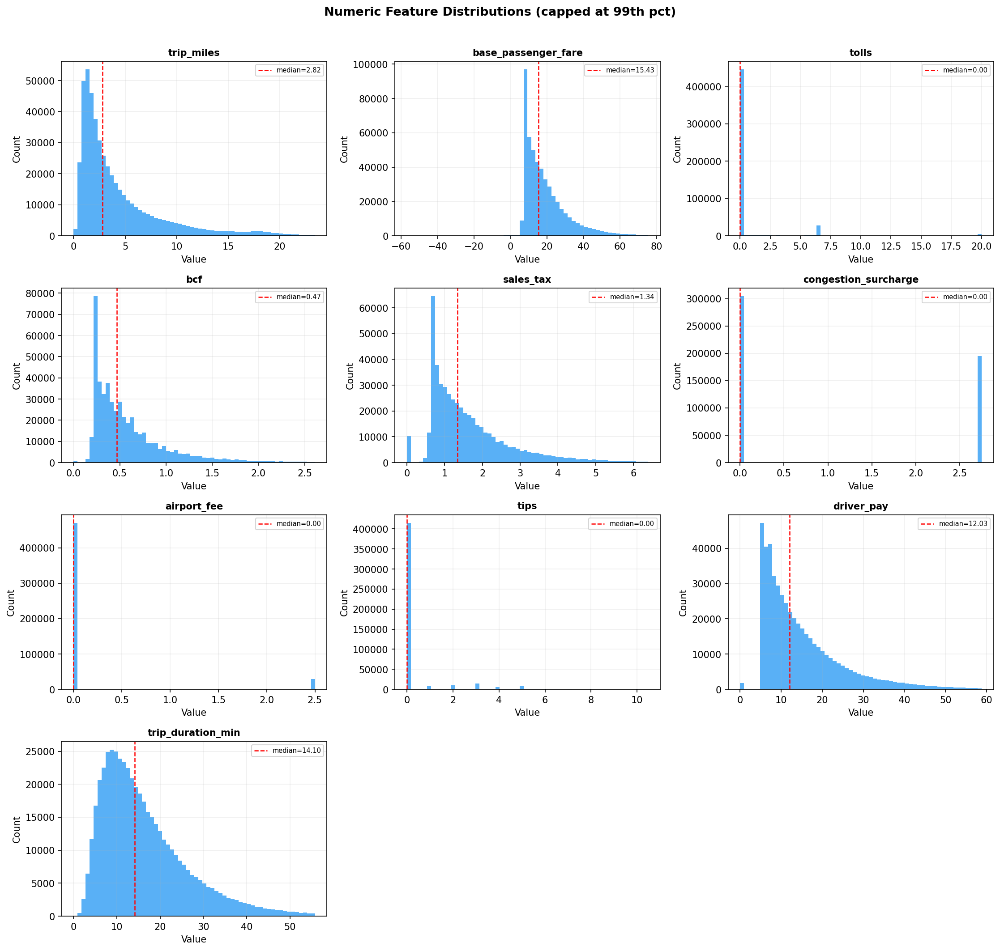
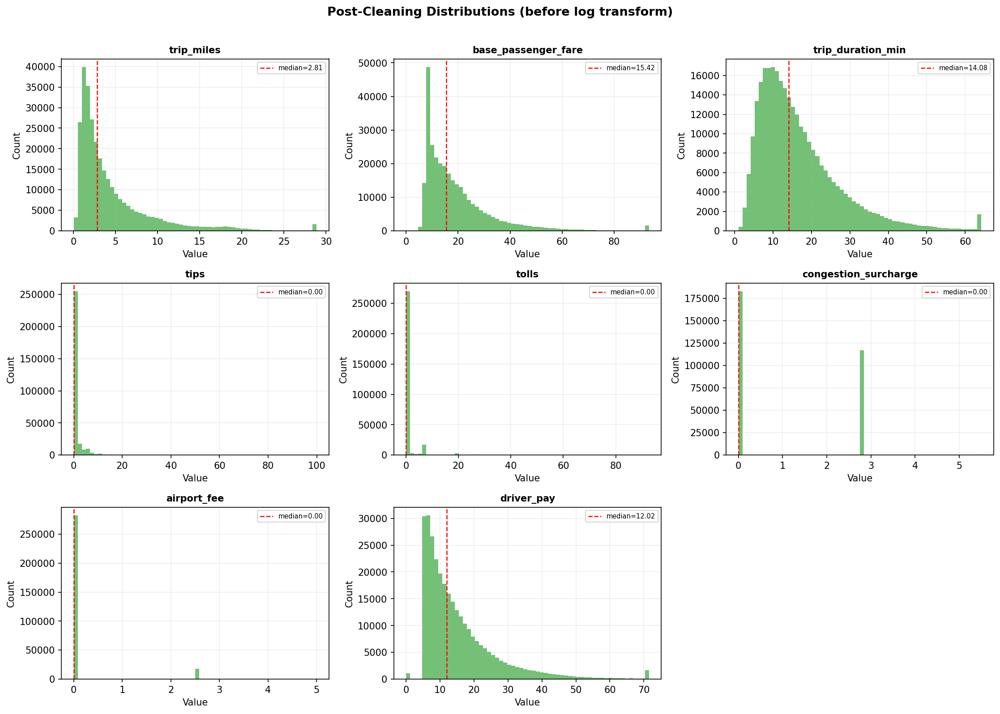
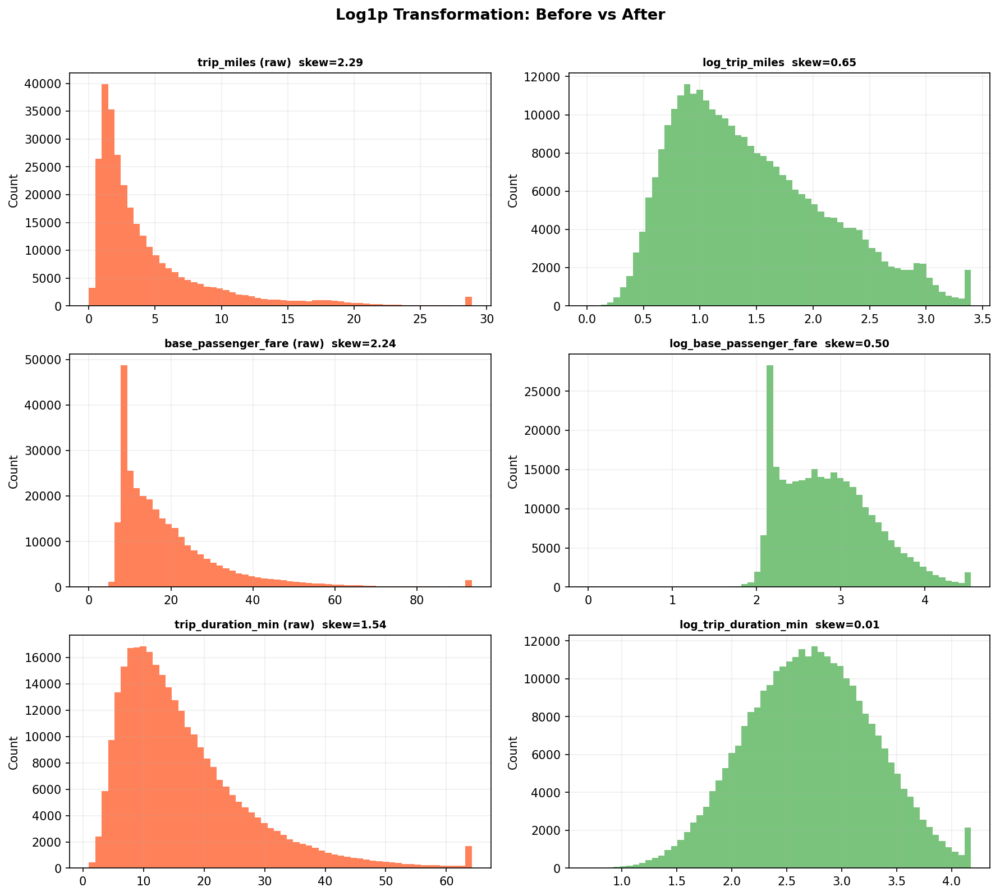
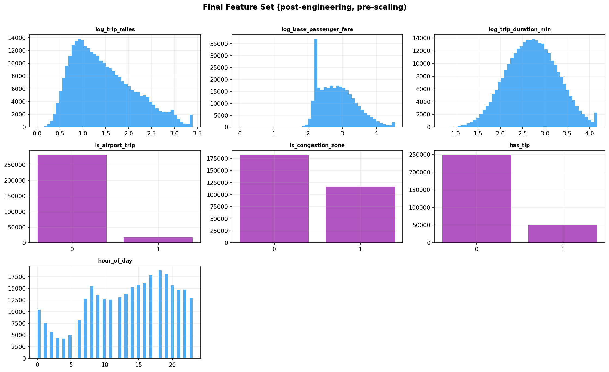
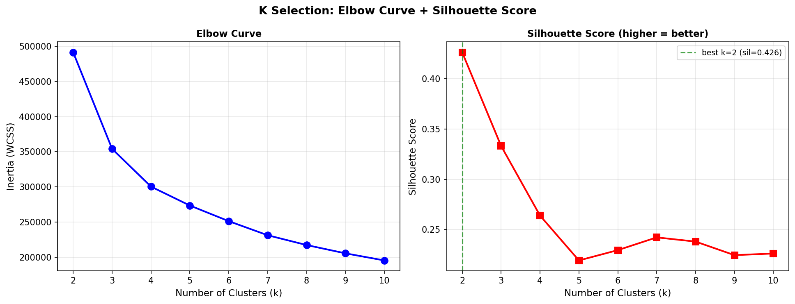
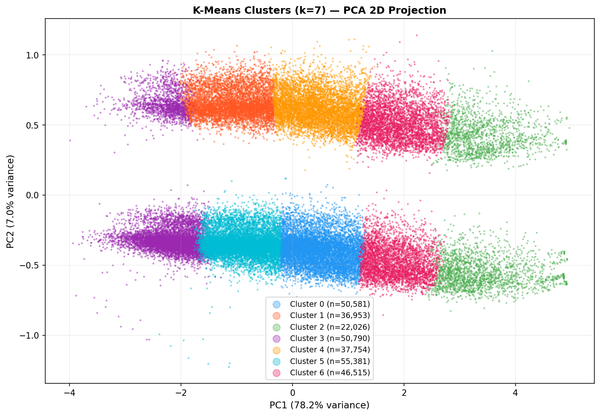
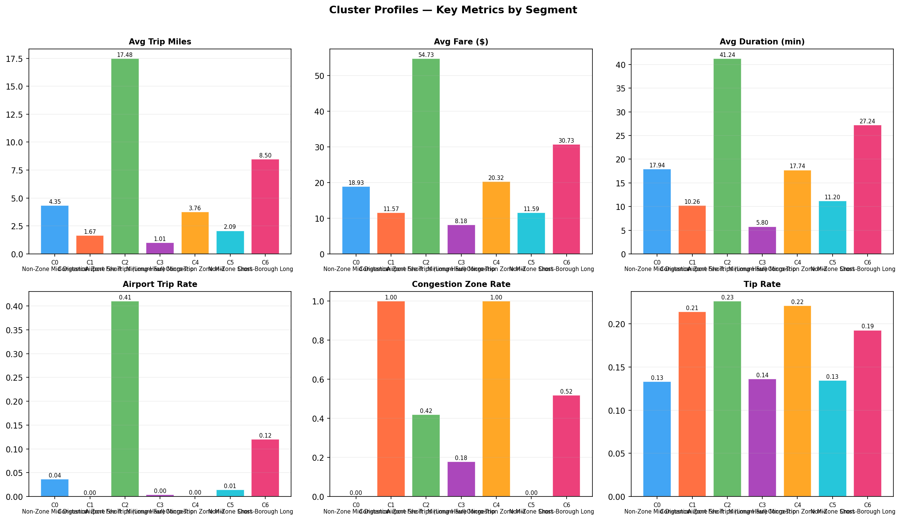
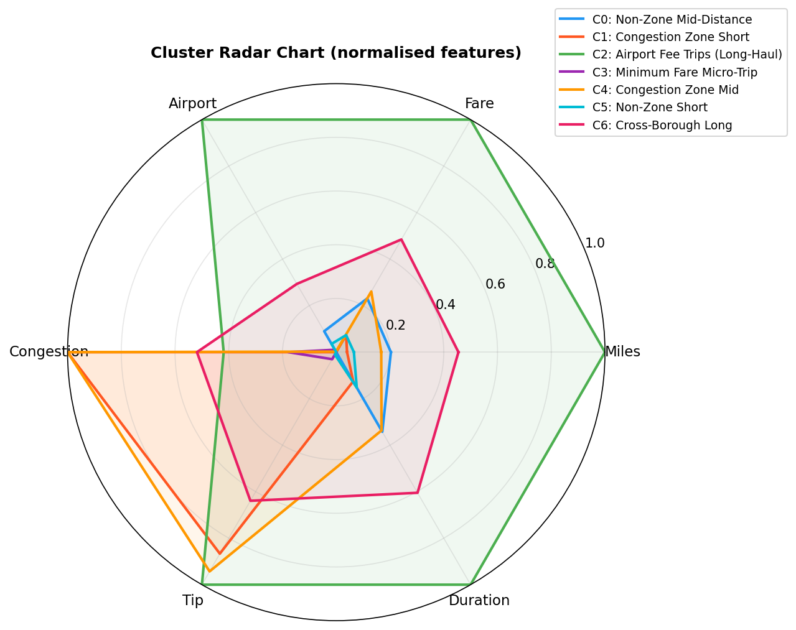
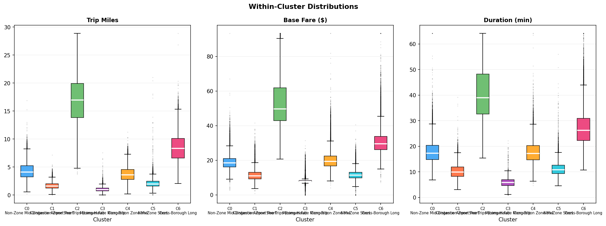
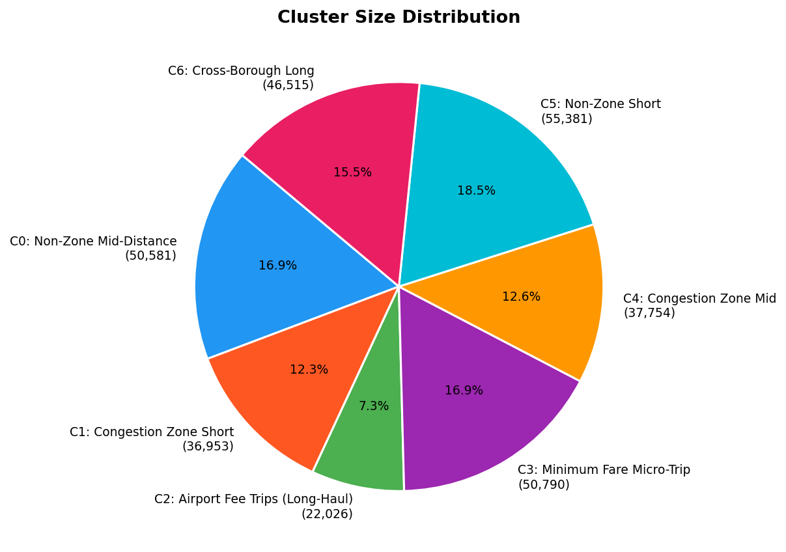

# NYC High-Volume FHV Trip Segmentation: K-Means Clustering


A complete end-to-end data science pipeline that clusters **14.7 million NYC Uber and Lyft trip records** into seven operationally distinct segments using K-Means. Data is sourced from the [AWS Registry of Open Data](https://registry.opendata.aws/nyc-tlc-trip-records-pds/).

---

## Table of Contents

- [Project Overview](#project-overview)
- [Dataset](#dataset)
- [Project Structure](#project-structure)
- [Pipeline Architecture](#pipeline-architecture)
- [Step 1: Exploratory Data Analysis](#step-1--exploratory-data-analysis)
- [Step 2: Data Cleaning](#step-2--data-cleaning)
- [Step 3: Feature Engineering](#step-3--feature-engineering)
- [Step 4: Scaling](#step-4--scaling)
- [Step 5: Modelling](#step-5--modelling)
- [Step 6: Evaluation](#step-6--evaluation)
- [Results](#results)
- [Installation](#installation)
- [Usage](#usage)
- [Running Unit Tests](#running-unit-tests)
- [Key Design Decisions](#key-design-decisions)
- [Limitations](#limitations)
- [References](#references)

---

## Project Overview

This project implements a K-Means clustering application on the NYC TLC High-Volume For-Hire Vehicle (HVFHV) dataset for January 2022. The pipeline follows a rigorous six-step data science methodology:

```
Raw Data → EDA → Cleaning → Scaling → Feature Engineering → Modelling → Evaluation
```

**Key outcomes:**
- 7 distinct trip segments identified from 300,000 sampled trips
- Silhouette score of 0.2423 at k=7 (moderate, consistent with real-world continuous data)
- EDA-driven feature selection reduced noise from 15 to 7 features, improving silhouette from 0.335 to 0.426
- 41 unit tests covering all pipeline stages; 100% pass rate

---

## Dataset

| Property | Value |
|---|---|
| **Source** | AWS Registry of Open Data |
| **Bucket** | `s3://nyc-tlc/` |
| **File** | `trip data/fhvhv_tripdata_2022-01.parquet` |
| **Managed by** | NYC Taxi and Limousine Commission (TLC) |
| **Raw records** | 14,751,591 rows × 24 columns |
| **Format** | Apache Parquet |
| **License** | [NYC Terms of Use](https://www1.nyc.gov/home/terms-of-use.page) |

**Download (no AWS account required):**
```bash
aws s3 cp 's3://nyc-tlc/trip data/fhvhv_tripdata_2022-01.parquet' . --no-sign-request
```

---

## Project Structure

```
nyc-hvfhv/
│
├── scripts/
│   ├── eda.py                  
│   ├── cleaning.py             
│   ├── feature_engineering.py  
│   ├── scaling.py              
│   ├── modelling.py            
│   └── evaluation.py           
│
├── main.py                     # Full pipeline orchestrator 
├── test.py                
│
│
└── README.md
```

---

## Pipeline Architecture

```
fhvhv_tripdata_2022-01.parquet
            │
            ▼
    ┌───────────────┐
    │  Step 1: EDA  │  Distributions, correlations, temporal patterns
    └───────┬───────┘
            │  Findings inform all downstream decisions
            ▼
    ┌────────────────────┐
    │  Step 2: Cleaning  │  Drop columns, remove invalid rows, cap outliers
    └─────────┬──────────┘
              │  cleaning_output/cleaned.parquet
              ▼
    ┌─────────────────────────────┐
    │  Step 3: Feature Engineering│  Log transforms, binary flags,
    └────────────┬────────────────┘  temporal encoding, feature selection
                 │  features_output/features.parquet  (7 features)
                 ▼
    ┌─────────────────┐
    │  Step 4: Scaling│  StandardScaler, MinMaxScaler, binary passthrough
    └────────┬────────┘
             │  scaling_output/scaled.parquet  (300k sample)
             ▼
    ┌──────────────────────┐
    │  Step 5: K-Means k=7 │  Elbow + silhouette analysis, PCA visualisation
    └──────────┬───────────┘
               │  modelling_output/model.pkl + labels.parquet
               ▼
    ┌──────────────────────┐
    │  Step 6: Evaluation  │  Cluster profiling, back-transform, labelling
    └──────────────────────┘
               │
               ▼
    7 Trip Segments Identified
```

---

## Step 1 — Exploratory Data Analysis

**Script:** `scripts/eda.py`

**Output:** `eda_output/`

EDA is performed before any feature selection or preprocessing decisions to ensure all choices are data-driven.

### Numeric Distributions



Key findings:
- All numeric features are highly right-skewed (skewness 1.4–7.6) - log transformation required
- `tips` and `tolls` are zero-inflated (median = $0) - standard capping would destroy them; binary flags needed instead
- `base_passenger_fare` shows a bimodal shape with a spike at $7.39 (the Uber/Lyft minimum fare floor)

### Feature Correlation Matrix


High-correlation pairs identified for removal:
| Pair | r | Decision |
|---|---|---|
| `bcf` - `base_passenger_fare` | 0.97 | Drop `bcf` (fare-derived) |
| `base_passenger_fare` - `driver_pay` | 0.94 | Drop `driver_pay` |
| `sales_tax` - `base_passenger_fare` | 0.78 | Drop `sales_tax` |
| `trip_miles` - `driver_pay` | 0.91 | Covered by above |

### Temporal Demand Patterns


- Peak demand: 17:00–19:00 (evening commute)
- Saturday is the busiest day of the week
- 3:00 - 5:00 AM is the quietest period

---

## Step 2 - Data Cleaning

**Script:** `scripts/cleaning.py`

**Input:** Raw parquet (14,751,591 rows)

**Output:** `cleaning_output/cleaned.parquet` (14,729,094 rows)

### Column Drops

| Column | Reason |
|---|---|
| `originating_base_num` | 26.6% null |
| `on_scene_datetime` | 26.6% null |
| `dispatching_base_num` | Redundant with `hvfhs_license_num` |
| `request_datetime` | Use `pickup_datetime` instead |
| `shared_request_flag` | 100% `N` — zero variance |
| `access_a_ride_flag` | Mostly blank |
| `wav_request_flag` | 99.9% `N` |
| `PULocationID`, `DOLocationID` | Raw zone integers not meaningful for K-Means without spatial join |

### Row Removals


| Condition | Rows Removed | Reason |
|---|---|---|
| Negative `base_passenger_fare` | 19,027 | Refunds and billing corrections recorded as negative values - not real trips |
| Negative `driver_pay` | 17 | Same as above - reversed payment entries |
| `trip_miles` ≤ 0 | 2,281 | Stationary or cancelled trips - zero distance is not a valid trip |
| `trip_duration_min` < 1 min | 1,162 | Sub-60-second trips may be  data entry errors or app misfires, not real journeys |
| Exact duplicates | 8 | Same pickup time, dropoff time, distance, and fare — duplicate records |
| **Total removed** | **22,497 (0.15%)** | Negligible impact on dataset size and distribution |


### Outlier Capping Strategy


- Continuous features (`trip_miles`, `base_passenger_fare`, `driver_pay`, `trip_duration_min`): **99.5th percentile cap**
- Zero-inflated (`tips`, `tolls`): **No capping** — converted to binary flags 

### Post-Cleaning Distributions



---

## Step 3 — Feature Engineering

**Script:** `scripts/feature_engineering.py`

**Output:** `features_output/features.parquet` (7 features)

### Log Transformation

Applied `log1p(x)` to all continuous right-skewed features:



| Feature | Skewness Before | Skewness After |
|---|---|---|
| `trip_miles` | 2.29 | 0.65 |
| `base_passenger_fare` | 2.24 | 0.50 |
| `trip_duration_min` | 1.54 | 0.01 |

`log1p(x)` is used rather than `log(x)` to safely handle zero values.

### Encoding Decisions

| Raw Feature | Transformation | Rationale |
|---|---|---|
| `tips` |  `has_tip` (binary) | Zero-inflated, value less important than presence |
| `tolls` |  `has_tolls` (binary) | Zero-inflated |
| `congestion_surcharge` |  `is_congestion_zone` (binary) | 3 discrete values, presence is the signal |
| `airport_fee` | `is_airport_trip` (binary) | Sparse; presence identifies airport runs |
| `hvfhs_license_num` | `is_uber` (1/0) | Binary operator flag |
| `pickup_datetime` |`hour_of_day`, `day_of_week`, `is_weekend`, `is_peak_morning`, `is_peak_evening` | Temporal demand patterns |

### Feature Selection 

**Retained (7 features):**

| Feature | Type | Justification |
|---|---|---|
| `log_trip_miles` | Continuous | Primary spatial dimension |
| `log_base_passenger_fare` | Continuous | Primary economic dimension |
| `log_trip_duration_min` | Continuous | Temporal, partially independent of fare |
| `is_airport_trip` | Binary | Strong structural separator |
| `is_congestion_zone` | Binary | Geographic separator |
| `has_tip` | Binary | Rider behaviour signal |
| `hour_of_day` | Ordinal | Demand pattern |

**Dropped and why:**

| Feature | Reason for Dropping |
|---|---|
| `has_tolls` | Correlated with `trip_miles` (r=0.50), redundant |
| `is_uber` | Operator label, not a trip characteristic |
| `is_shared` | 0.014% of trips — near-zero variance |
| `is_wav` | 5.2% of trips — adds noise not signal |
| `day_of_week`, `is_weekend` | Low discriminative power vs `hour_of_day` |
| `is_peak_morning`, `is_peak_evening` | Too sparse to anchor clusters |

### Final Feature Set



---

## Step 4 — Scaling

**Script:** `scripts/scaling.py`

**Output:** `scaling_output/scaled.parquet`, `scaling_output/scaler.pkl`

Different scaling strategies are applied by feature type:

| Feature Group | Method | Rationale |
|---|---|---|
| `log_trip_miles`, `log_base_passenger_fare`, `log_trip_duration_min` | **StandardScaler**  | Roughly normal after log transform; appropriate for Euclidean distance |
| `hour_of_day` | **MinMaxScaler** → [0,1] | Ordinal, not ratio-scale; StandardScaler would imply hour 23 is "23× more" than hour 1 |
| `is_airport_trip`, `is_congestion_zone`, `has_tip` | **No scaling** | Already on [0,1]  |


Scalers are saved to `scaler.pkl` for use during cluster centre back-transformation in evaluation.

---

## Step 5 — Modelling

**Script:** `scripts/modelling.py`

**Output:** `modelling_output/model.pkl`, `modelling_output/labels.parquet`

### K Selection

K-Means was evaluated for k=2 to k=10 using two complementary metrics:



| k | Inertia | Silhouette |  Inertia |
|---|---|---|---|
| 2 | 491,321 | 0.4260 | — |
| 3 | 354,089 | 0.3330 | 137,232 |
| 4 | 300,422 | 0.2639 | 53,666 |
| 5 | 273,502 | 0.2194 | 26,921 |
| 6 | 251,276 | 0.2296 | 22,225 |
| **7** | **231,250** | **0.2423** | **20,026** |
| 8 | 217,312 | 0.2381 | 13,938 |
| 9 | 205,501 | 0.2246 | 11,811 |
| 10 | 195,404 | 0.2263 | 10,097 |

**Why k=7?**
- Local silhouette peak at k=7 (0.2423) - higher than k=4, k=5, k=6
- PCA projection confirmed visually distinct, non-overlapping cluster regions
- k=2 (best silhouette) was rejected as too coarse -  "short vs long" is not actionable
- The elbow curve has no sharp inflection, consistent with real-world continuous data


### PCA 2D Projection



PCA explains 85.2% of variance across two components. The seven clusters occupy distinct spatial regions rather than arbitrary vertical slices, validating the k=7 choice.

---

## Step 6 — Evaluation

**Script:** `scripts/evaluation.py`

**Output:** `evaluation_output/`

Cluster centres are back-transformed from scaled space to original units using `expm1()` (inverse of `log1p()`) for interpretable profiling.

### Cluster Profiles



### Radar Chart



### Within-Cluster Distributions



### Cluster Size Distribution



---

## Results

Seven distinct trip segments were identified:

| Cluster | Segment | Avg Miles | Avg Fare | Avg Duration | Airport | Congestion | Tip Rate | Share |
|---|---|---|---|---|---|---|---|---|
| C0 | Non-Zone Mid-Distance | 4.4 | $18.93 | 17.9 min | 4% | 0% | 13% | 16.9% |
| C1 | Congestion Zone Short | 1.7 | $11.57 | 10.3 min | 0% | 100% | 21% | 12.3% |
| C2 | Airport Fee Trips (Long-Haul) | 17.5 | $54.73 | 41.2 min | 41% | 42% | 23% | 7.3% |
| C3 | Minimum Fare Micro-Trip | 1.0 | $8.18 | 5.8 min | 0% | 18% | 14% | 16.9% |
| C4 | Congestion Zone Mid | 3.8 | $20.32 | 17.7 min | 0% | 100% | 22% | 12.6% |
| C5 | Non-Zone Short | 2.1 | $11.59 | 11.2 min | 1% | 0% | 13% | 18.5% |
| C6 | Cross-Borough Long | 8.5 | $30.73 | 27.2 min | 12% | 52% | 19% | 15.5% |

**Size balance (min/max):** 0.398 - acceptable, no severely imbalanced clusters.

### Key Findings

1. **Airport trips (C2)** represent only 7.3% of volume but average $54.73 - 6.7× the cheapest segment and the largest per-trip revenue contributor.
2. **Non-Zone Short (C5)** is the largest segment at 18.5%, confirming that the modal NYC ride-hailing trip is a short outer-borough journey under $12.
3. **Congestion zone clusters (C1, C4)** collectively represent 24.9% of trips and show consistently higher tip rates (21-22%) than non-zone segments (13%), suggesting a different rider demographic.
4. **Tipping is rare across all segments** — below 23% in every cluster, with no segment approaching majority tipping behaviour.
5. **Minimum Fare Micro-Trips (C3)** have an average duration of just 5.8 minutes, suggesting these are minimum-fare floor trips, likely influenced by Uber/Lyft base pricing policy.

---

## Installation

```bash
# Clone the repository
git clone https://github.com/Doro97/NYC-HVFHV-Trip.git

# Install dependencies
pip install pandas numpy scikit-learn matplotlib pyarrow pytest
```

**Python version:** 3.12+

**Dependencies:**

| Package | Version | Purpose |
|---|---|---|
| pandas | ≥1.5 | Data loading and manipulation |
| numpy | ≥1.23 | Numerical operations |
| scikit-learn | ≥1.2 | KMeans, StandardScaler, MinMaxScaler, PCA, silhouette_score |
| matplotlib | ≥3.6 | All visualisations |
| pyarrow | ≥11.0 | Parquet file I/O |
| pytest | ≥7.0 | Unit test runner |

---

## Usage

### Full Pipeline

```bash
# Download the data first
aws s3 cp 's3://nyc-tlc/trip data/fhvhv_tripdata_2022-01.parquet' . --no-sign-request

# Run the full pipeline
python main.py
```


### Step-by-Step (individual scripts)

```bash
python scripts/eda.py
python scripts/cleaning.py
python scripts/feature_engineering.py
python scripts/scaling.py
python scripts/modelling.py
python scripts/evaluation.py
```


---

## Running Unit Tests

```bash
python -m pytest test_main.py -v
```

**41 tests across 6 test classes**

| Test Class | Tests | What Is Tested |
|---|---|---|
| `TestDataCleaning` | 9 | Negative values, zero miles, short trips, duplicates, outlier capping, tips/tolls preservation |
| `TestFeatureEngineering` | 11 | Log transforms, binary flags, hour range, final feature set, no nulls, all numeric |
| `TestScaling` | 6 | Mean=0/std=1, MinMax range [0,1], binary passthrough, scaler serialisable |
| `TestKMeansModel` | 7 | Label count/range, centre shape, inertia monotonicity, determinism, model serialisable |
| `TestClusterEvaluation` | 7 | Back-transform correctness, profile shape, size balance, no unclassified labels |
| `TestPipeline` | 1 | End-to-end smoke test on synthetic data (no real parquet required) |

All tests use **synthetic data** — the real 1.2 GB parquet file is not required to run the test suite.


---

## Limitations

1. **Geographic labels are inferred, not verified.** `is_congestion_zone` is derived from the `congestion_surcharge` field, not from `PULocationID`/`DOLocationID` zone mapping (dropped in cleaning). A future improvement would cross-reference TLC zone shapefiles for precise geographic attribution.

2. **K-Means assumes spherical clusters.** The PCA projection shows non-spherical structure in some clusters. DBSCAN or Gaussian Mixture Models would accommodate this more accurately.

3. **January 2022 only.** Seasonal variation (summer tourism, holiday periods, weather) may produce different cluster structures in other months.

4. **Moderate silhouette score.** A silhouette of 0.2423 reflects genuine continuity in the data — trips exist on a spectrum, not in discrete natural groups. Clusters should be treated as useful operational segments rather than mathematically pure groupings.

5. **Sample-based modelling.** The 300k sample is representative but not exhaustive. Rare trip types (e.g. WAV trips at 5.2%) may be underrepresented in some cluster runs.

---

## References

- Amazon Web Services. (2024). *NYC TLC trip records*. Registry of Open Data on AWS. https://registry.opendata.aws/nyc-tlc-trip-records-pds/
- Géron, A. (2022). *Hands-on machine learning with Scikit-Learn, Keras, and TensorFlow* (3rd ed.). O'Reilly Media.
- Han, J., Kamber, M., & Pei, J. (2022). *Data mining: Concepts and techniques* (4th ed.). Morgan Kaufmann.
- Lloyd, S. P. (1982). Least squares quantization in PCM. *IEEE Transactions on Information Theory, 28*(2), 129–137.
- New York City Taxi and Limousine Commission. (2024). *TLC trip record data*. https://www1.nyc.gov/site/tlc/about/tlc-trip-record-data.page
- Pedregosa, F., et al. (2011). Scikit-learn: Machine learning in Python. *Journal of Machine Learning Research, 12*, 2825–2830.
- Rousseeuw, P. J. (1987). Silhouettes: A graphical aid to the interpretation and validation of cluster analysis. *Journal of Computational and Applied Mathematics, 20*, 53–65.
- Thorndike, R. L. (1953). Who belongs in the family? *Psychometrika, 18*(4), 267–276.

---

*Dataset accessed January 2022. Analysis conducted as part of BAN 6440*